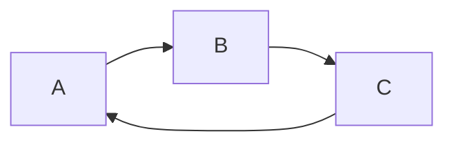

# Test Note


## Subtitle

```ts
function greet(name: string = 'World') {
  console.log(`Hello ${name}!`);
}
```

$$
\lambda^{\epsilon}
$$


```mermaid
flowchart LR

A --> B
B --> C
C --> A
```


> [!question] Title
> Contents
